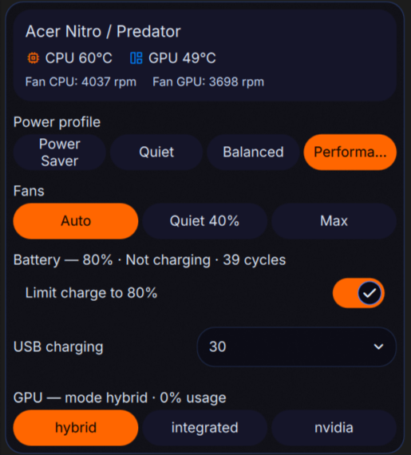
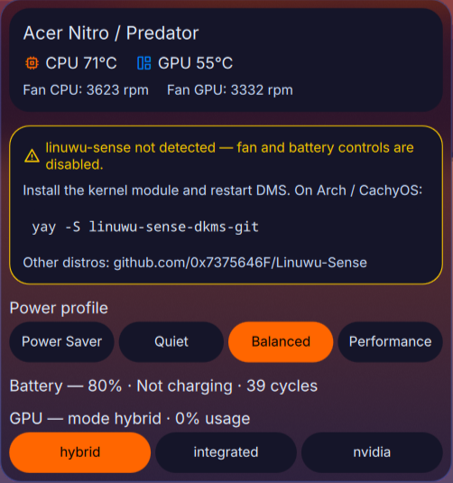

# Acer Sense — DankMaterialShell plugin

A laptop control panel for **Acer Nitro / Predator** laptops, in your [DankMaterialShell](https://danklinux.com) bar. A pill shows the current power profile + live CPU temp; clicking it opens a popout with everything in one place.



## Features

- **Power profile** — low-power / quiet / balanced / performance (`platform_profile`)
- **Fans** — Auto / Quiet (configurable %) / Max (`linuwu-sense` `fan_speed`)
- **Battery** — charge level, status, cycle count, 80% charge limit toggle, USB charging while closed
- **GPU** — current mode + temperature/usage; switch hybrid/integrated/nvidia via `envycontrol` (with confirmation)
- Live temps & fan RPM in the popout; the bar pill content is configurable (CPU temp / fan RPM / nothing)
- The discrete GPU is **only queried while the popout is open**, so it never gets woken from sleep just to draw the bar

## Requirements

- **DankMaterialShell** ≥ 1.4.0
- An **Acer Nitro or Predator** laptop with the **[linuwu-sense](https://github.com/0x7375646F/Linuwu-Sense)** kernel module loaded (provides `acer-wmi` `nitro_sense` / `predator_sense` in sysfs). Without it, the profile still works but fan/battery controls won't.
- *Optional:* `nvidia-smi` and `envycontrol` — the GPU section auto-hides if absent.

> Tested on an Acer Nitro (ANV15-51). Predator support uses the same `linuwu-sense` interface (`predator_sense`) and is best-effort — reports welcome.

## Installing linuwu-sense

The fan, charge-limit and USB-charging controls write to the `acer-wmi` `nitro_sense` / `predator_sense` sysfs nodes, which are provided by the [**linuwu-sense**](https://github.com/0x7375646F/Linuwu-Sense) **DKMS kernel module**.

**This plugin does _not_ install it for you** — a bar widget has no business compiling and loading kernel modules. Install it once yourself:

**Arch / CachyOS** (AUR):

```bash
yay -S linuwu-sense-dkms-git      # or: paru -S linuwu-sense-dkms-git
sudo modprobe linuwu_sense        # load now (auto-loads on boot afterwards)
```

**Other distros** — build from source following the [upstream README](https://github.com/0x7375646F/Linuwu-Sense) (clone → `make` → install via DKMS so it survives kernel updates → `sudo modprobe linuwu_sense`).

Verify it loaded — this directory should now exist:

```bash
ls /sys/devices/platform/acer-wmi/nitro_sense   # or predator_sense on a Predator
```

Then **restart DMS** (`dms restart`).

Without the module the panel still shows the **power profile**, **battery readout** and **CPU temp**; the fan/battery/USB controls are hidden and the popout shows a notice with these install steps:



## Install

### Via DMS (after it's in the registry)

```bash
dms plugins install acerSense
```

Or in DMS: **Settings (Mod+,) → Plugins → Browse → Acer Sense**.

### Manually

```bash
git clone https://github.com/raphamzn/dms-acer-sense.git \
  ~/.config/DankMaterialShell/plugins/acerSense
dms restart
```

### Privileged helper (required for the control buttons)

Writing to `platform_profile`, `fan_speed`, `battery_limiter`, etc. needs root. A small whitelisted helper + a single `NOPASSWD` rule handle that. **Run once:**

```bash
sudo sh ~/.config/DankMaterialShell/plugins/acerSense/helper/install.sh
```

This installs `/usr/local/bin/acer-ctl` and `/etc/sudoers.d/acer-ctl` (NOPASSWD scoped to that one binary, for the user who runs the script). Without this step the panel is **read-only** — telemetry shows, but the buttons do nothing.

### Enable

**Settings → Plugins → Scan for Plugins → enable Acer Sense → add `acerSense` to your DankBar.**

## Settings

- **Language** — UI language: English (default) / Português / Español
- **Pill content** — what shows next to the icon: CPU temp / fan RPM / nothing
- **Fan Quiet (%)** — the speed used by the "Quiet" preset
- **Refresh interval** — sysfs poll cadence

### Translations

UI strings live in [`translations.js`](translations.js) — English keys with `pt`/`es` overrides and a `tr(key, lang)` fallback. To add a language, add its code to each entry (and to the selector in `AcerSenseSettings.qml`); PRs welcome.

## Security

`acer-ctl` is a ~60-line POSIX `sh` script that validates every argument against a strict whitelist before touching sysfs. The sudoers rule grants `NOPASSWD` to *that binary only*, so the surface is one auditable file. Review `helper/acer-ctl` before installing.

⚠️ The **GPU switch** button actually runs `envycontrol -s <mode>`, which ends the graphics session and requires a **reboot**. Use it only when you really intend to switch.

## Credits

Built for [DankMaterialShell](https://danklinux.com) by AvengeMedia. Hardware control via [Linuwu-Sense](https://github.com/0x7375646F/Linuwu-Sense).

## License

MIT — see [LICENSE](LICENSE).
